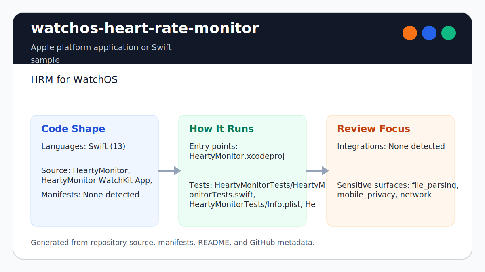

# watchos-heart-rate-monitor

<!-- README-OVERVIEW-IMAGE -->


## Overview

`garethpaul/watchos-heart-rate-monitor` is an Apple platform application or Swift sample. HRM for WatchOS

This README is based on the checked-in source, manifests, scripts, and repository metadata on the `master` branch. The project language mix found during review was: Swift (13).

## Repository Contents

- `HeartyMonitor` - source or example code
- `HeartyMonitor WatchKit App` - source or example code
- `HeartyMonitor WatchKit Extension` - source or example code
- `HeartyMonitor.xcodeproj` - Xcode project file
- `HeartyMonitorTests` - source or example code
- `HeartyMonitorUITests` - source or example code
- `SECURITY.md` - security reporting and disclosure guidance
- `VISION.md` - project direction and maintenance guardrails

Additional scan context:

- Source directories: HeartyMonitor, HeartyMonitor WatchKit App, HeartyMonitor WatchKit Extension, HeartyMonitorTests, HeartyMonitorUITests
- Dependency and build manifests: none detected
- Entry points or build surfaces: HeartyMonitor.xcodeproj
- Test-looking files: HeartyMonitorTests/HeartyMonitorTests.swift, HeartyMonitorTests/Info.plist, HeartyMonitorUITests/HeartyMonitor/AppDelegate.swift, HeartyMonitorUITests/HeartyMonitor/Assets.xcassets/AppIcon.appiconset/Contents.json, HeartyMonitorUITests/HeartyMonitor/Info.plist, HeartyMonitorUITests/HeartyMonitor/ViewController.swift, HeartyMonitorUITests/HeartyMonitor WatchKit App/Assets.xcassets/AppIcon.appiconset/Contents.json, HeartyMonitorUITests/HeartyMonitor WatchKit App/Assets.xcassets/Contents.json, and 4 more

## Getting Started

### Prerequisites

- Git
- macOS with Xcode for building Apple platform projects

### Setup

```bash
git clone https://github.com/garethpaul/watchos-heart-rate-monitor.git
cd watchos-heart-rate-monitor
```

The setup commands above are derived from repository files. Legacy mobile, Python, or JavaScript samples may require older SDKs or package versions than a modern workstation uses by default.

## Running or Using the Project

- Open `HeartyMonitor.xcodeproj` in Xcode, choose the app or sample scheme, and run it on the matching simulator/device.

## Testing and Verification

- `make verify` runs static WatchKit contract checks and attempts an Xcode build when `xcodebuild` is available.
- `make check` runs `make verify` with bytecode cleanup before and after.
- `python3 scripts/check_watchos_contracts.py` runs the HealthKit privacy,
  entitlement, plan, query-lifecycle, authorization UI-thread, workout
  session-start, workout delegate UI-thread, query-start failure, heart-rate
  value-bound, and workout session-failure/session-end contracts.
- Completed maintenance plans live under `docs/plans` and are checked by
  `make check`.
- Xcode's test action or `xcodebuild test` can be used with the appropriate scheme and destination on a macOS/Xcode workstation.

When the required SDK or runtime is unavailable, use static checks and source review first, then verify on a machine that has the matching platform toolchain.

## Configuration and Secrets

- No required secret or credential file was identified in the repository scan. If you add integrations later, keep secrets out of git.
- HealthKit read access uses `NSHealthShareUsageDescription` to explain that the sample reads heart-rate data for live workout feedback.

## Security and Privacy Notes

- Review changes touching network requests, sockets, or service endpoints; examples from the scan include HeartyMonitor/Info.plist, HeartyMonitor WatchKit App/Info.plist, HeartyMonitor WatchKit Extension/Info.plist, HeartyMonitorTests/Info.plist, and 5 more.
- Review changes touching mobile permissions or privacy-sensitive device data; examples from the scan include HeartyMonitor/AppDelegate.swift, HeartyMonitor/Info.plist, HeartyMonitor WatchKit Extension/Info.plist, HeartyMonitor WatchKit Extension/InterfaceController.swift, and 4 more.
- Review changes touching file, media, JSON, XML, CSV, OCR, or data parsing; examples from the scan include HeartyMonitor/Info.plist, HeartyMonitor WatchKit App/Info.plist, HeartyMonitor WatchKit Extension/Info.plist, HeartyMonitorTests/Info.plist, and 5 more.

## Maintenance Notes

- This looks like an Apple platform project or sample. Xcode, Swift, CocoaPods, and deployment target versions may need to match the original project era.
- See `SECURITY.md` for vulnerability reporting and safe research guidance.
- See `VISION.md` for project direction and contribution guardrails.
- See `docs/plans/2026-06-08-healthkit-privacy-strings.md` for the current
  HealthKit privacy and query baseline.
- See `docs/plans/2026-06-08-watchkit-uitest-query-mirror.md` for the duplicated
  WatchKit controller lifecycle mirror.
- See `docs/plans/2026-06-08-watchkit-session-start.md` for non-forced workout
  session startup in the app and UI-test mirror.
- See `docs/plans/2026-06-09-watchkit-session-failure-ui.md` for mirrored
  failed-session UI and non-sensitive logging coverage.
- See `docs/plans/2026-06-09-watchkit-session-end-ui.md` for mirrored normal
  ended-session UI cleanup.
- See `docs/plans/2026-06-09-watchkit-authorization-main-thread.md` for
  mirrored HealthKit authorization denial UI dispatch.
- See `docs/plans/2026-06-09-watchkit-query-start-failure-ui.md` for mirrored
  cleanup when heart-rate streaming query creation fails.
- See `docs/plans/2026-06-09-watchkit-heart-rate-value-bounds.md` for mirrored
  bounds checks before heart-rate values are converted for display.
- See `docs/plans/2026-06-09-watchkit-session-delegate-main-thread.md` for
  mirrored workout session delegate UI dispatch coverage.

## Contributing

Keep changes small and tied to the project that is already present in this repository. For code changes, document the toolchain used, avoid committing generated dependency directories or local configuration, and update this README when setup or verification steps change.
